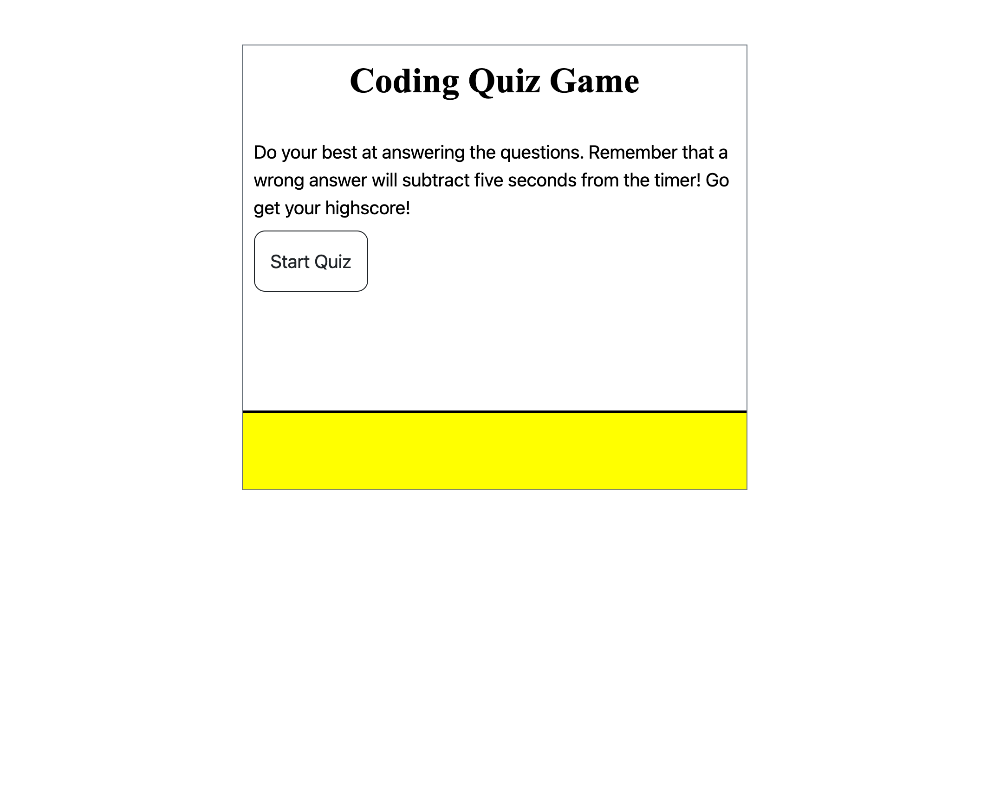
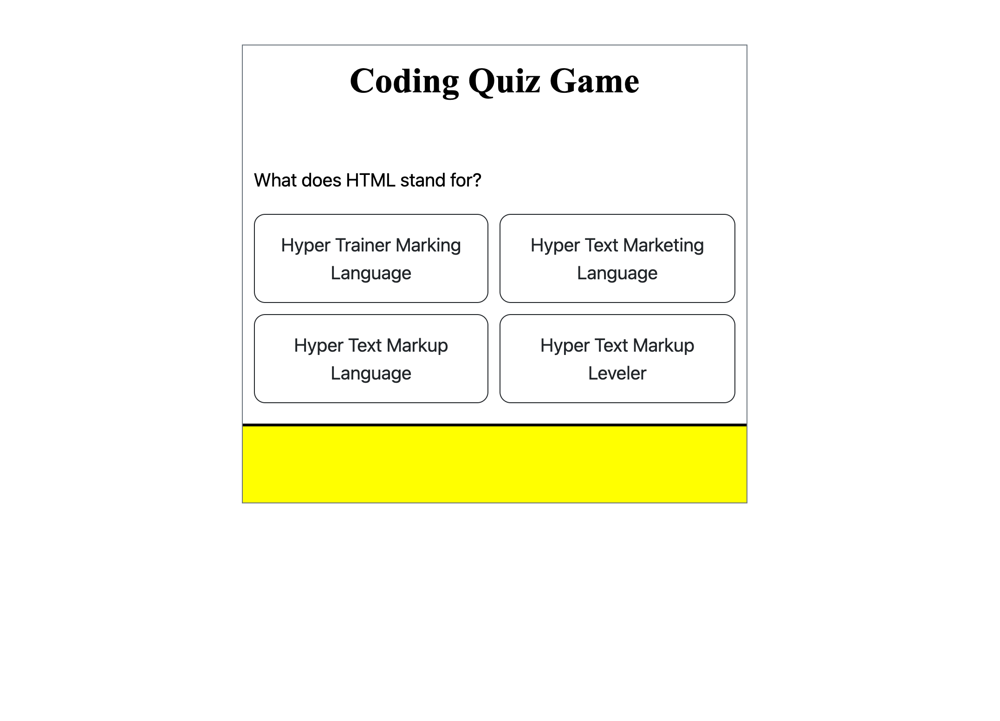
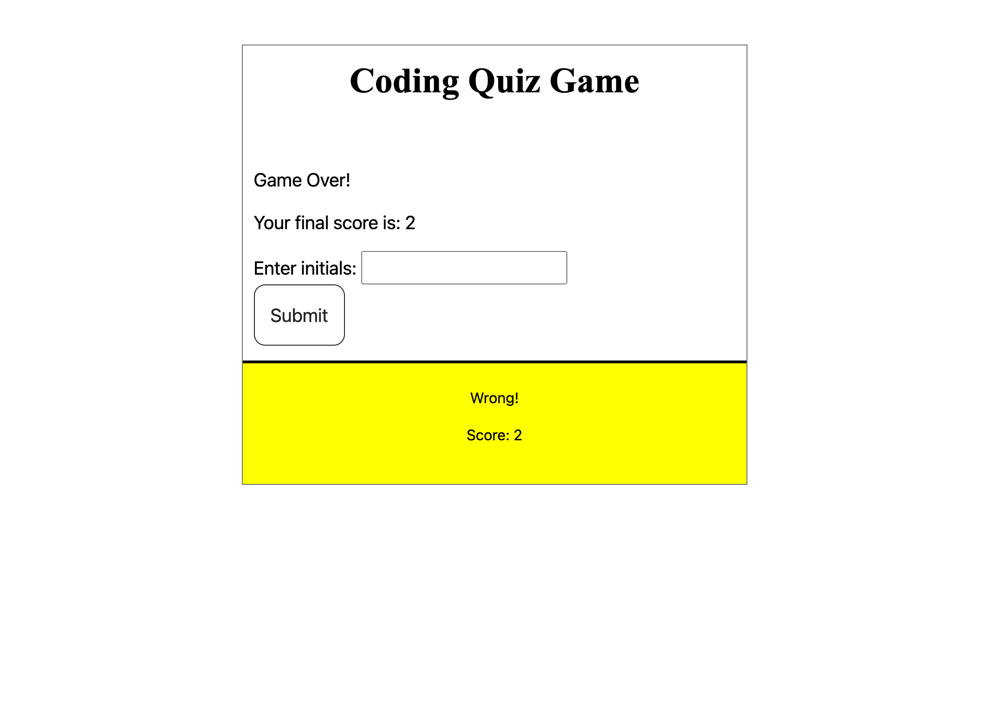

# Module-4
Module 4 challenge

## User Story

* AS A coding boot camp student
I WANT to take a timed quiz on JavaScript fundamentals that stores high scores
SO THAT I can gauge my progress compared to my peers

## Acceptance Criteria

* It is done when I click on the button to start the quiz.

* It is done when the start quiz button is click, the first question is displayed and the timer starts.

* It is done when the user answers the questions and the screen displays "Correct or Wrong."

* It is done when the timer subjects 5 seconds for each missed question and no time lost for every correct answer. 

* It is done when all questions are answered or the timer reaches zero. 

* It is done when the game is over and the user is prompted to enter their initials for their results

* It is done when the user results are displayed and given the option to "play again or clear results." 

## References

* W3schools.com

* Mdn Docs https://developer.mozilla.org/en-US/

* Coding with Javascript for Dummies book.

* Website I got the questions from: https://www.interviewbit.com/javascript-mcq/

* Google Search on coding quiz games for javascript.  

* Used YouTube to see how things were coded. 

* Stack OverFlow was used to help create the quiz timer and functions.

* Was helped with rwaynewhite5 on structure of the coding. 

* Used website https://www.javascript.com 

* Tutoring sessions.

## ASSETS

